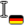
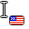
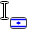
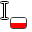
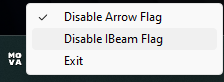

## An application for displaying language near the cursor

### Flagged languages:
- English (USA)
- Ukrainian
- German
- Hebrew
- Polish

### It is possible to turn off the flags on the pointer or text cursor in the tray:

