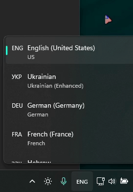

# An application for displaying language near the cursor.

## Flagged languages:
- English (USA)
- Ukrainian
- German
- Hebrew
- Polish

Є можливість вимикати застосунок у треї:

Для автозапуску застосунка розмістіть ярлик на Mova ось тут: C:\ProgramData\Microsoft\Windows\Start Menu\Programs\Startup

