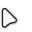
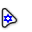
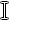
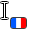
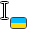
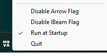

## MovaFlag is an application for displaying language near the cursor

### Flagged languages:
- German
- English (USA)
- French
- Hebrew
- Italian
- Polish
- Ukrainian

### It is possible to turn off the flags on the pointer or text cursor in the tray:

